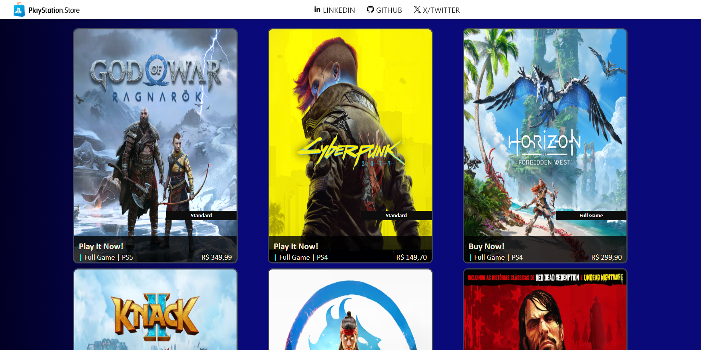

# Projeto - Game Store

Projeto destinado a criação de um modelo de uma loja virtual de jogos com o framework [Angular](https://angular.io), baseando-se no layout da PSN Store

## Desenvolvimento

Para desenvolvimento do blog foi utilizado a versão [14.1.2](https://v14.angular.io/docs) do Angular.

A loja ainda está em processo inicial, possui apenas a homepage.

### Homepage do blog

## Projeto realizado por Lucas Cipriano

### Contatos

* [Linkedin](https://www.linkedin.com/in/lucas-cipriano-3801b6172/)
* [E-mail](mailto:lucas.cipra@gmail.com)
* [WhatsApp](https://wa.me/+5511988732277)

